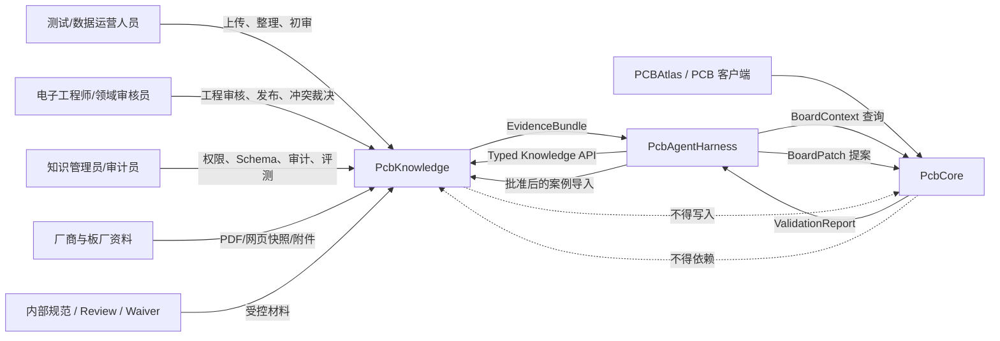
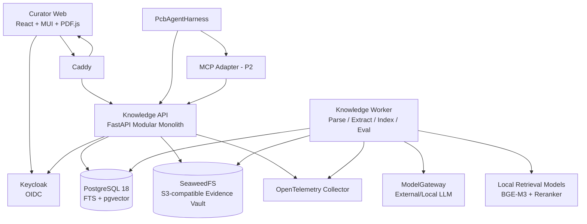
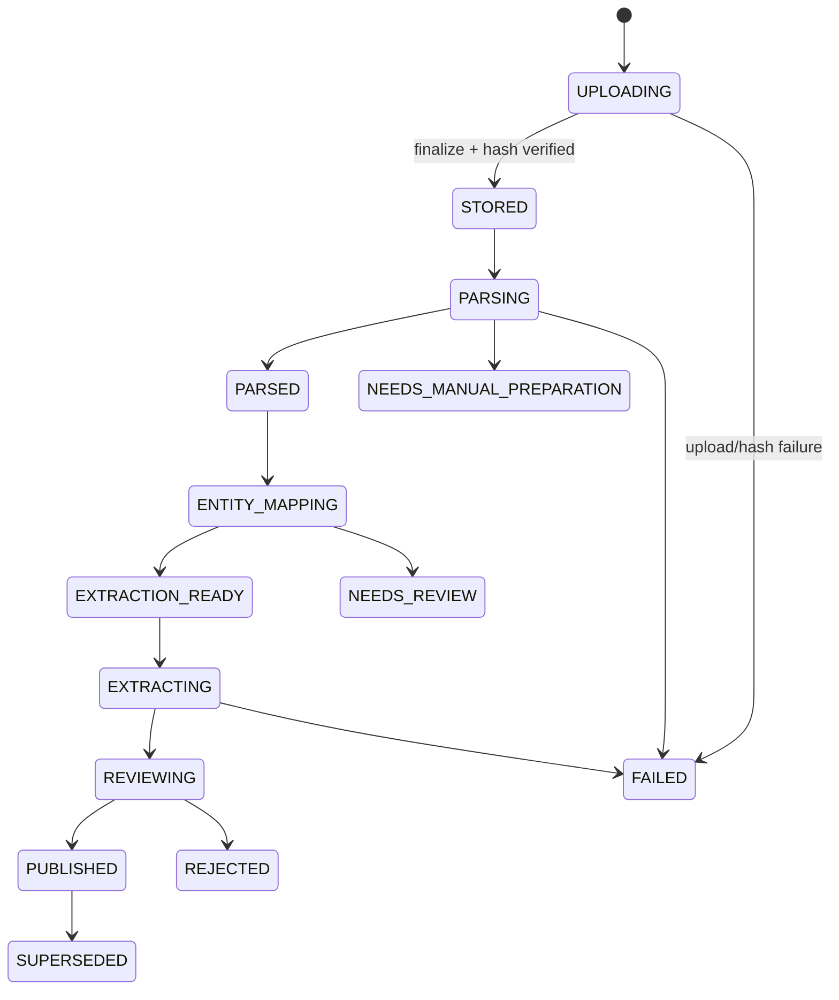
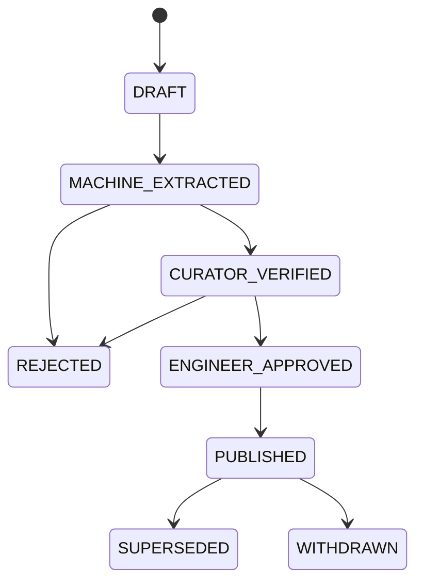
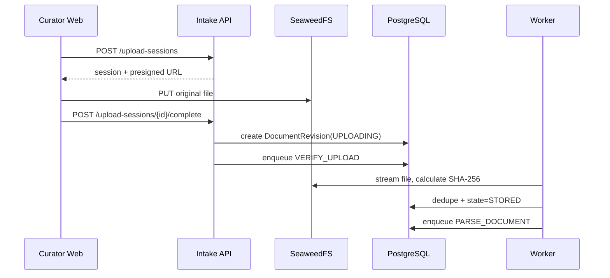
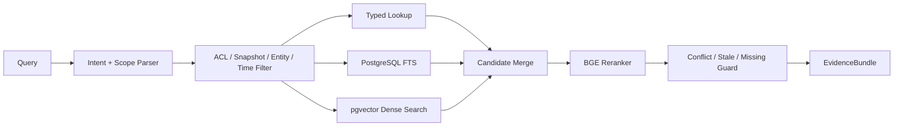

# PcbKnowledge 工程知识与证据平台架构设计

> 文档状态：架构基线（Baseline）  
> 文档版本：1.0  
> 基线日期：2026-08-07  
> 适用阶段：P0–P2  
> 目标仓库：`PcbKnowledge`  
> 关联系统：`PcbCore`、`PcbAgentHarness`、PCBAtlas/其他 PCB 客户端  
> 主要读者：架构师、后端工程师、前端工程师、测试/数据运营人员、电子工程师、Agent 工程师

---

## 0. 执行摘要

`PcbKnowledge` 是面向 PCB 全流程 Agent 的**工程知识与证据平台**。它不是一个“上传 PDF 后聊天”的通用 RAG 应用，也不是 PcbCore 的组成部分。

系统负责：

1. 接收 datasheet、application note、reference design、PCN、板厂能力、内部规范、design review、waiver 和历史工程材料；
2. 对原始材料进行不可变保存、版本治理、实体对齐、结构化抽取和人工审核；
3. 向人和 Agent 提供带版本、适用范围、冲突状态和原文证据的结构化知识；
4. 保存可复现的知识快照、检索轨迹、评测结果和审计记录；
5. 在后续阶段接收经批准的 `BoardPatch`、`ValidationReport` 和设计决策，形成经过验证的工程案例库。

本架构坚持以下资产边界：

```text
永久资产
= 原始文档
+ 文档版本元数据
+ EvidenceAnchor
+ 结构化 KnowledgeRecord
+ 人工审核记录
+ 冲突/替代关系
+ KnowledgeSnapshot
+ Golden Eval

可重建派生物
= 文本块
+ 页面缩略图
+ 全文索引
+ embedding
+ vector index
+ reranker cache
+ 自动摘要
```

由此得到三个强制结论：

- **P0 不以向量数据库为核心，也不要求向量检索上线。**
- **任何高风险工程结论都不能只来自模型输出。**
- **PcbCore 不依赖 PcbKnowledge；PcbKnowledge 故障不能阻止 PCB 的打开、编辑、布局、布线和确定性验证。**

### 0.1 已固定的技术选型

| 层级 | 最终选型 | 基线约束 |
|---|---|---|
| 架构形态 | 模块化单体 + 独立 Worker 进程 | P0/P1 不拆微服务 |
| 前端运行时 | Node.js 24 LTS + pnpm | 构建环境按 lockfile 和镜像 digest 固定 |
| 前端 | React 19 + TypeScript + Vite 8 | 单页桌面 Web 应用 |
| UI 组件 | Material UI 9 | 不使用 Tailwind，不依赖 MUI X Pro |
| 路由 | React Router 7 | URL 必须可恢复工作台状态 |
| 服务端状态 | TanStack Query 5 | 禁止把远程缓存复制进全局 store |
| 表格 | TanStack Table 9 + TanStack Virtual | 面向大队列和高密度审核列表 |
| 本地 UI 状态 | Zustand 5 | 仅保存临时交互状态和布局偏好 |
| 表单 | React Hook Form + Zod | 前后端 Schema 双重校验 |
| PDF UI | PDF.js 6 + 自研 Evidence Overlay | 不使用黑盒 PDF SaaS Viewer |
| 前端测试 | Vitest + Testing Library + Playwright | Playwright 覆盖关键审核流程 |
| 后端语言 | Python 3.14 | 使用 `uv` 管理环境和锁文件 |
| Web API | FastAPI + Pydantic 2 | REST/JSON + OpenAPI 3.1 |
| ORM/迁移 | SQLAlchemy 2 + Alembic + psycopg 3 | 禁止在业务层拼接 SQL |
| 数据库 | PostgreSQL 18 | 唯一事务事实源 |
| 向量扩展 | pgvector | P1 启用，索引可重建 |
| 对象存储 | SeaweedFS S3 API | 原始文件以 SHA-256 内容寻址 |
| PDF 解析 | Docling | 本地解析；结构、表格和版面优先 |
| PDF 兜底/缩略图 | pypdfium2 | 仅做渲染、页级检查和兜底提取 |
| 异步任务 | PostgreSQL Job Queue | `FOR UPDATE SKIP LOCKED` + lease |
| 身份认证 | Keycloak，OIDC Authorization Code + PKCE | 企业可联合现有 OIDC/LDAP |
| 反向代理 | Caddy 2 | TLS、静态资源和 API 反向代理 |
| 可观测性 | OpenTelemetry + Prometheus + Grafana | 结构化日志、指标、trace_id |
| 本地 embedding | `BAAI/bge-m3` | P1；模型文件按 SHA 固定 |
| 本地 reranker | `BAAI/bge-reranker-v2-m3` | P1；仅对小候选集运行 |
| LLM 抽取 | `ModelGateway` + OpenAI Responses API Structured Outputs | 仅处理策略允许外发的材料；`store=false` |
| Agent 接口 | Typed REST API；P2 增加 MCP Adapter | MCP 不是内部领域协议 |
| 部署 | Linux + Docker Compose | 首期单环境可部署、可备份、可恢复 |

### 0.2 明确不采用的方案

P0/P1 明确不采用：

- 微服务拆分；
- Kubernetes；
- Kafka；
- Redis/Celery；
- Temporal/Camunda；
- OpenSearch/Elasticsearch；
- Neo4j；
- LangChain/LlamaIndex 作为核心框架；
- “一个 `ask_documents()` 接口覆盖全部业务”；
- 将 Board IR、net、pin、trace 等当前板卡状态向量化后作为事实查询方式；
- 允许测试人员直接写数据库或直接编辑向量索引；
- 允许 LLM 自动发布高风险工程事实。

这些能力只有在文末定义的升级触发条件满足后，才允许通过 ADR 引入。

---

## 1. 背景与问题定义

PCB Agent 全流程需要处理两类性质完全不同的信息：

### 1.1 当前工程状态

包括：

- 当前元件、封装、引脚、网络和连接关系；
- 几何对象、层叠、区域、线宽、间距、过孔和铜皮；
- 当前约束、ERC/DRC/DFM 结果；
- `BoardPatch`、快照、语义差异和验证报告。

这类信息必须由 `PcbCore` 的精确数据结构、查询接口和确定性引擎提供，不能依赖 RAG。

### 1.2 外部工程知识

包括：

- 元器件 datasheet；
- application note；
- reference design；
- pin function 和 alternate function；
- absolute maximum rating；
- recommended operating conditions；
- 电源时序；
- 去耦要求；
- 晶振、复位和启动电路；
- 厂商布局指南；
- IPC/其他标准；
- 板厂工艺能力；
- 公司内部设计规范；
- 历史 design review；
- approved waiver；
- 器件生命周期、PCN 和替代关系。

这类内容数量大、版本多、条件复杂、持续变化，并且必须能够回溯到明确来源。它们构成 `PcbKnowledge` 的职责范围。

---

## 2. 架构目标与非目标

### 2.1 目标

`PcbKnowledge` 必须实现：

1. **证据可追溯**：任何已发布知识都能定位到具体文档版本、页码和页面区域；
2. **版本可复现**：Agent 任务可锁定知识快照，半年后仍能复现当时使用的材料；
3. **实体不混淆**：MPN、orderable part、package、silicon revision 和内部料号必须可区分；
4. **条件不丢失**：数值、限制和规则必须保留单位、条件、适用范围和权威等级；
5. **冲突不覆盖**：不同来源或不同版本的冲突必须显式呈现；
6. **人机协同审核**：测试人员负责数据运营和证据核验，电子工程师负责高风险工程批准；
7. **检索可解释**：返回值必须说明命中过滤条件、排名、版本、证据和冲突；
8. **权限不泄漏**：项目机密材料、waiver 和内部规范不可跨组织/项目检索；
9. **派生索引可重建**：更换 embedding、切块算法或数据库索引不影响永久资产；
10. **Agent 可编程调用**：提供 typed API，而不是只提供自然语言问答；
11. **测试人员可尽早开始录入**：P0 首个可用版本不依赖向量检索和复杂模型；
12. **保持 PcbCore 独立**：PcbCore 不链接、不调用、不等待本系统。

### 2.2 非目标

P0/P1 不负责：

- PCB 几何建模、连接分析、ERC、DRC、DFM 或仿真；
- 自动布局和自动布线算法；
- 供应链采购系统或库存 ERP；
- 通用企业文档搜索；
- 对所有 PDF 做无人工干预的“完美结构化”；
- 自动认定元件可替代；
- 自动批准设计 waiver；
- 以 LLM 输出替代电子工程师签核；
- 对付费标准进行未经授权的抽取、embedding 或模型处理；
- 面向公众的多租户 SaaS。

---

## 3. 系统上下文与边界

### 3.1 上下文图



### 3.2 责任边界

| 系统 | 负责 | 不负责 |
|---|---|---|
| `PcbCore` | 当前 Board IR、几何、连接、约束、确定性验证、Patch 应用 | 外部文档、datasheet 版本、RAG、审核工作台 |
| `PcbKnowledge` | 文档、证据、结构化知识、审核、冲突、快照、检索、案例 | 修改 PCB、判断几何是否最终合法 |
| `PcbAgentHarness` | 任务计划、上下文组合、工具调用、审批、恢复、闭环 | 成为工程事实源或绕过 PcbCore 验证 |
| PCB 客户端 | 面向设计人员的 Board UI 和交互 | 企业知识治理后台 |

### 3.3 关键调用原则

```text
Agent 先从 PcbCore 获取精确 BoardContext
→ 提取 MPN / package / board_revision / project_scope
→ 调用 PcbKnowledge typed API
→ 获得 EvidenceBundle
→ 生成 BoardPatch 提案
→ 由 PcbCore 做 ERC/DRC/DFM/Simulation
→ 人工审批
→ 应用或回滚
```

`PcbKnowledge` 不获得直接修改 Board 的工具权限。

---

## 4. 架构原则与不可妥协约束

### 4.1 Evidence-first

所有可用于工程决策的记录必须具有 `EvidenceAnchor`。没有证据的模型输出只能处于 `MACHINE_EXTRACTED`，不能进入 `PUBLISHED`。

### 4.2 Structured-first，Text-assisted

精确事实优先查询结构化记录；原始文本检索用于：

- 补充上下文；
- 发现尚未结构化的知识；
- 支持开放式工程建议；
- 展示原文证据；
- 触发新的抽取和审核任务。

### 4.3 Unknown is valid

以下返回都是正常结果：

- `FOUND`；
- `CONFLICTED`；
- `NOT_APPLICABLE`；
- `UNKNOWN`；
- `ACCESS_DENIED`；
- `STALE`。

系统禁止用同系列器件、相似封装或模型常识填补未知事实。

### 4.4 Published records are immutable

已发布记录不原地修改。任何修正都生成新版本，并通过 `supersedes` 关联旧版本。旧记录在历史快照中仍可读取。

### 4.5 Exact scope before semantic similarity

检索顺序固定为：

```text
ACL / tenant / project
→ effective_at / knowledge_snapshot
→ manufacturer / MPN / package / silicon_revision
→ record_type / authority / review_state
→ 精确结构化查询
→ PostgreSQL FTS
→ dense vector
→ reranker
→ conflict / stale / missing 检查
```

### 4.6 No silent conflict resolution

同一 subject、parameter、conditions 和有效时间内出现不同值时，必须创建 `KnowledgeConflict`。排名更高的来源可以成为推荐项，但不能删除或隐藏冲突项。

### 4.7 Security before convenience

文档内容是**不可信数据**，不是 Agent 指令。解析器、抽取器和检索结果都不能改变系统提示、工具权限或审批策略。

---

## 5. 总体架构

### 5.1 架构形态

P0/P1 采用**模块化单体 + 独立 Worker**：

```text
同一代码库、同一领域模型、同一 PostgreSQL

进程 1：API
进程 2..N：Worker
进程 3：Curator Web 静态站点
进程 4：MCP Adapter（P2，独立部署）
```

选择该形态的原因：

- 知识记录、审核、权限、冲突和快照需要强事务一致性；
- 初期团队规模和吞吐不需要微服务；
- 能避免 Schema、消息和部署复杂度先于业务复杂度增长；
- API 与 Worker 可独立扩容，保留未来拆分边界；
- 所有领域模块必须通过模块接口访问，禁止跨模块直接引用 ORM repository。

### 5.2 逻辑容器图



### 5.3 两个业务平面

#### Knowledge Factory

负责：

- Intake；
- Source Registry；
- Immutable Evidence Vault；
- Parse & Normalize；
- Entity Resolution；
- Typed Extraction；
- Human Review；
- Publish；
- Re-index；
- Evaluation。

#### Knowledge Serving Plane

负责：

- typed lookup；
- exact/FTS/vector hybrid retrieval；
- ACL 和项目隔离；
- knowledge snapshot；
- EvidenceBundle；
- Agent 审计；
- 冲突、缺失和过期提示。

---

## 6. 技术架构决策

### 6.1 前端技术栈

```text
Node.js 24 LTS
pnpm
React 19
TypeScript
Vite 8
Material UI 9
React Router 7
TanStack Query 5
TanStack Table 9
TanStack Virtual
Zustand 5
React Hook Form
Zod
PDF.js 6
Apache ECharts
Vitest
Testing Library
Playwright
pnpm
```

#### 选择规则

- MUI 负责主题、布局、表单、菜单、按钮、Dialog 和基础表格视觉；
- TanStack Table 负责大列表的数据模型、列、排序、筛选和虚拟化；
- 不采用 MUI X Pro，避免审核工作台核心能力受商业许可证约束；
- TanStack Query 负责服务器缓存、失效和重试；
- Zustand 只保存面板尺寸、当前选择、快捷键模式等 UI 状态；
- URL 保存搜索、过滤器、文档、页码、记录和 review task 标识；
- PDF.js 直接集成，不使用长期滞后的 React PDF Viewer 封装；
- 所有 API TypeScript 类型由 OpenAPI 自动生成；
- 不使用 Redux；
- 不使用 Tailwind；
- 不允许在组件内直接调用 `fetch`。

### 6.2 后端技术栈

```text
Python 3.14
uv
FastAPI
Pydantic 2
SQLAlchemy 2
Alembic
psycopg 3
PostgreSQL 18
pgvector
Docling
pypdfium2
FlagEmbedding
OpenTelemetry SDK
pytest
```

#### 选择规则

- FastAPI 暴露 REST/JSON 与 OpenAPI；
- Pydantic 是 API DTO 和 extraction schema 的唯一 Python 定义；
- SQLAlchemy ORM 对应持久化模型，但领域对象不得直接暴露 ORM 实例；
- Alembic 迁移必须与应用版本一起提交；
- PostgreSQL 是唯一事务数据库；
- 业务代码不依赖 LangChain/LlamaIndex；
- LLM、embedding 和 reranker 通过明确的 provider interface 接入；
- `PcbKnowledge` 内部不使用 gRPC；仅在未来有高吞吐跨语言内部调用时再评估。

### 6.3 存储技术栈

| 数据 | 存储 | 说明 |
|---|---|---|
| 文档、实体、事实、审核、ACL、任务、审计 | PostgreSQL | 事务事实源 |
| 原始 PDF/网页快照/附件 | SeaweedFS | S3 API，内容寻址，不可原地覆盖 |
| Docling canonical JSON | SeaweedFS | 可重建但保留便于审计 |
| 页级缩略图 | SeaweedFS | WebP，派生资产 |
| FTS | PostgreSQL `tsvector` + GIN | P0/P1 |
| dense vector | pgvector | P1 |
| 模型文件 | 受控本地模型目录/对象存储 | 记录 SHA-256 和许可证 |
| 临时上传 | SeaweedFS `staging/` | 完成校验后转为内容地址 |
| 日志 | JSON stdout + 主机日志轮转 | P0；需要集中日志时接入 Loki |

### 6.4 身份与权限

- Keycloak 作为参考 IdP；
- 浏览器采用 OIDC Authorization Code + PKCE；
- API 校验 JWT `iss`、`aud`、`exp` 和签名；
- 服务间调用使用独立 service account；
- 用户、组织、项目和角色以外部 subject ID 映射；
- PostgreSQL Row-Level Security 作为纵深防御，不替代应用层授权；
- 所有下载原文、查询项目材料和 Agent 调用必须生成审计事件。

### 6.5 部署技术栈

```text
Linux
Docker Compose
Caddy 2
Keycloak
PostgreSQL 18
SeaweedFS
PcbKnowledge API
PcbKnowledge Worker
Curator Web
OpenTelemetry Collector
Prometheus
Grafana
```

P0 不使用 Kubernetes。所有镜像必须按 digest 固定，生产部署不能使用 `latest`。

---

## 7. 代码仓库与模块边界

### 7.1 Monorepo 结构

```text
PcbKnowledge/
├── apps/
│   ├── curator-web/                 # React Web
│   ├── api/                         # FastAPI 进程入口
│   ├── worker/                      # Worker 进程入口
│   └── mcp-adapter/                 # P2；只转发 typed API
├── packages/
│   ├── contracts/                   # OpenAPI、JSON Schema、枚举、示例
│   ├── ui-kit/                      # 产品级 MUI 主题和复用组件
│   └── test-fixtures/               # 脱敏 PDF、bundle、golden data
├── src/pcbknowledge/
│   ├── platform/
│   │   ├── config/
│   │   ├── database/
│   │   ├── object_store/
│   │   ├── auth/
│   │   ├── audit/
│   │   ├── jobs/
│   │   ├── observability/
│   │   └── model_gateway/
│   ├── modules/
│   │   ├── intake/
│   │   ├── documents/
│   │   ├── parsing/
│   │   ├── entities/
│   │   ├── extraction/
│   │   ├── knowledge/
│   │   ├── review/
│   │   ├── conflicts/
│   │   ├── search/
│   │   ├── snapshots/
│   │   ├── evaluations/
│   │   └── agent_api/
│   └── shared/
│       ├── ids/
│       ├── units/
│       ├── time/
│       └── errors/
├── migrations/
├── deploy/
│   ├── compose/
│   ├── caddy/
│   ├── keycloak/
│   └── observability/
├── knowledge-schemas/
│   ├── fact/
│   ├── rule/
│   ├── decision/
│   ├── waiver/
│   ├── case/
│   └── lifecycle/
├── evals/
│   ├── extraction/
│   ├── retrieval/
│   ├── permissions/
│   └── agent/
├── docs/
│   ├── architecture/
│   ├── adr/
│   ├── operations/
│   └── data-curation/
├── pyproject.toml
├── uv.lock
├── pnpm-workspace.yaml
└── compose.yaml
```

### 7.2 模块访问规则

1. 模块只能通过 `application service` 或公开 domain interface 互相调用；
2. 禁止一个模块直接 import 另一个模块的 SQLAlchemy model；
3. `platform` 不依赖领域模块；
4. `agent_api` 只编排现有查询，不拥有独立事实；
5. `search` 只保存可重建索引，不成为知识事实源；
6. `review` 决定状态迁移，不直接修改已发布记录；
7. `extraction` 只能生成候选记录；
8. `mcp-adapter` 不访问数据库，只调用 REST API。

### 7.3 事务边界

一个 HTTP 请求只允许一个显式 transaction。跨进程副作用使用 transactional outbox：

```text
业务事务提交
├── 写入领域数据
├── 写入 audit_event
└── 写入 outbox_event

Worker 拉取 outbox_event
→ 执行索引、缩略图、通知或影响分析
→ 标记完成
```

---

## 8. 前端架构与 UI 设计

### 8.1 产品定位

Curator Web 是**桌面优先的工程审核工作台**，不是面向移动设备的内容管理后台。

基线环境：

- 最低有效分辨率：1440 × 900；
- 推荐：1920 × 1080 或更高；
- 支持 Chrome/Edge 当前与前一稳定版本；
- Safari 支持常规浏览和轻量审核，但不是 P0 自动化验收浏览器；
- 不提供手机布局；窄窗口显示“分辨率不足”模式。

### 8.2 用户角色

| 角色 | 核心任务 | 能否发布高风险记录 |
|---|---|---:|
| `DATA_CURATOR` | 上传、元数据、实体映射、证据核验、低风险初审 | 否 |
| `DOMAIN_REVIEWER` | 工程审核、冲突裁决、规则批准 | 是 |
| `KNOWLEDGE_ADMIN` | Schema、权限、来源策略、批量操作 | 是，但操作受审计 |
| `AUDITOR` | 只读审计、快照、访问记录 | 否 |
| `AGENT_SERVICE` | typed API 调用 | 否 |

### 8.3 信息架构与路由

| 路由 | 页面 | P0 |
|---|---|---:|
| `/dashboard` | Dashboard | 是 |
| `/intake` | Intake Inbox | 是 |
| `/intake/new` | 上传向导 | 是 |
| `/documents` | 文档库 | 是 |
| `/documents/:revisionId` | 文档详情 | 是 |
| `/review` | 审核任务队列 | 是 |
| `/review/:taskId` | Review Workbench | 是 |
| `/entities` | 实体浏览 | 是 |
| `/entities/resolve` | Entity Resolver | 是 |
| `/knowledge` | Knowledge Explorer | 是 |
| `/knowledge/:recordId` | 知识记录详情/历史 | 是 |
| `/conflicts` | Conflict Center | P1 |
| `/search` | Evidence Search | 是 |
| `/snapshots` | Knowledge Snapshot | P1 |
| `/evals` | Eval Center | 是 |
| `/audit` | Audit Explorer | 是 |
| `/admin/sources` | 来源与许可证策略 | 是 |
| `/admin/schemas` | Schema Registry | P1 |
| `/admin/jobs` | Job Monitor | 是 |

### 8.4 全局布局

```text
┌────────────────────────────────────────────────────────────────────┐
│ Top App Bar: Workspace / Project / Global Search / Jobs / User     │
├──────────────┬─────────────────────────────────────────────────────┤
│ Left Nav     │ Main Route Outlet                                   │
│ 224 px       │                                                     │
│ collapsible  │                                                     │
└──────────────┴─────────────────────────────────────────────────────┘
```

- 左侧导航默认 224 px，可折叠为 64 px；
- 顶栏 56 px；
- 主内容区采用 8 px spacing scale；
- 表格默认 compact density，行高 36 px；
- 表单字段默认 40 px；
- 核心工作流不依赖深层 modal；
- 所有“发布、拒绝、覆盖、批量变更”操作使用二次确认，并显示影响范围。

### 8.5 Review Workbench

这是系统最重要的页面，固定采用四区布局：

```text
┌──────────────┬──────────────────────────────┬──────────────────────┐
│ Page Rail    │ PDF Canvas                   │ Record Inspector     │
│ 220–280 px   │ flexible                     │ 380–520 px           │
│ thumbnails   │ PDF.js + evidence overlay    │ fields / validation  │
├──────────────┴──────────────────────────────┴──────────────────────┤
│ Bottom Dock: Evidence | Source Text | History | Conflict | Audit    │
│ 220–360 px，可折叠                                                │
└────────────────────────────────────────────────────────────────────┘
```

#### Page Rail

- 页面缩略图；
- 已审核/待审核/有冲突标记；
- 页面类型标签：table、pinout、diagram、text；
- 当前字段涉及页高亮；
- 支持页码直接跳转。

#### PDF Canvas

- PDF.js 原始 PDF 渲染；
- EvidenceAnchor 使用独立 SVG overlay；
- anchor 坐标采用 PDF 原始页归一化坐标 `[0,1]`；
- 点击字段跳转并闪烁对应区域；
- 框选区域可创建/替换 anchor；
- 支持文字选择，但文字本身不作为唯一证据定位方式；
- 缩放、旋转和页切换不能改变 anchor 的逻辑坐标。

#### Record Inspector

按以下顺序展示：

1. record type；
2. subject entity；
3. payload fields；
4. units/conditions/applicability；
5. authority/risk/confidence；
6. evidence anchors；
7. validation errors；
8. review actions。

审核动作固定为：

- `Accept candidate`；
- `Edit and accept`；
- `Reject`；
- `Mark unknown`；
- `Create conflict`；
- `Not applicable`；
- `Escalate to domain reviewer`；
- `Publish`（仅有权限且策略允许时）。

#### Bottom Dock

- `Evidence`：当前记录所有原文锚点；
- `Source Text`：Docling 规范化文本和表格；
- `History`：当前记录版本和审核历史；
- `Conflict`：同 subject/parameter/scope 的候选冲突；
- `Audit`：模型、Prompt、Schema、用户操作和时间。

### 8.6 审核交互规则

- 表单自动保存到 draft，但不自动发布；
- 每次保存带 `If-Match`/ETag，防止覆盖他人修改；
- 发生版本冲突时提供字段级 diff，不静默 merge；
- `Ctrl/Cmd + S` 保存；
- `A` 接受、`R` 拒绝、`E` 编辑、`C` 创建冲突；快捷键在输入框聚焦时失效；
- 离开未保存页面必须提示；
- 发布前显示：来源、风险、冲突、缺失字段和影响的快照/Agent；
- 批量审核只允许低风险、相同 schema、相同来源策略的候选项；
- 高风险工程记录禁止“一键全部通过”。

### 8.7 上传向导

上传固定为五步：

```text
1. Select Files
2. Source & License
3. Document Identity
4. Entity Binding
5. Confirm & Submit
```

必须录入：

- source type；
- license class；
- manufacturer/source organization；
- document number；
- revision；
- issued date（允许 unknown）；
- document type；
- access scope；
- 关联实体（允许进入待解析队列）。

上传采用浏览器直传对象存储的预签名 URL。完成后 API 创建 `DocumentRevision` 并由 Worker 做服务器端 SHA-256 校验。

### 8.8 Entity Resolver

页面布局：

```text
左：待解析字符串和来源上下文
中：候选实体列表与差异
右：选中实体的 family / package / orderable part / revision 图谱
```

解析规则：

- MPN 字符串原样保存；
- 标准化字符串仅用于查询，不能覆盖原始值；
- family、base part、orderable part 分开；
- package code 和 package geometry 分开；
- silicon revision 不能从 marketing family 推断；
- 低置信度候选必须人工选择；
- 合并实体属于管理员操作，并保留 redirect 和审计记录。

### 8.9 Knowledge Explorer

提供：

- 结构化筛选；
- 记录详情；
- 来源预览；
- 版本链；
- 冲突链；
- 哪些 snapshot/Agent run 引用了该记录；
- 导出 JSON；
- 创建修正版本；
- 标记 stale/superseded。

Knowledge Explorer 不提供直接修改 `PUBLISHED` 记录的编辑按钮，只能“创建新版本”。

### 8.10 前端状态分层

| 状态类型 | 存放位置 |
|---|---|
| API 返回、分页、搜索结果、任务详情 | TanStack Query |
| 路由、过滤器、页码、当前 task | URL |
| 表单草稿 | React Hook Form；服务端 draft 自动保存 |
| 面板尺寸、折叠、主题密度 | Zustand + localStorage |
| OIDC session | access token 仅保存在内存；通过 PKCE/刷新轮换续期；不写 localStorage |
| 权限 | API 返回的 capability + token claims |

### 8.11 组件边界

核心复用组件：

```text
DocumentUploadWizard
DocumentMetadataForm
PdfEvidenceViewer
EvidenceOverlay
EvidenceAnchorEditor
KnowledgeRecordForm
EntityPicker
ConditionsEditor
UnitValueEditor
ReviewDecisionBar
ConflictDiffViewer
RecordHistoryTimeline
AclScopeChip
LicensePolicyBanner
JobStatusPanel
EvaluationResultGrid
```

UI 组件不包含领域请求逻辑；对应逻辑进入 route-level feature hooks。

---

## 9. 后端模块设计

### 9.1 `intake`

职责：

- 创建上传会话；
- 生成预签名上传地址；
- 保存来源和访问策略；
- 完成上传；
- 创建 `DocumentRevision`；
- 触发 hash、格式和恶意内容检查。

不负责 PDF 解析和知识抽取。

### 9.2 `documents`

职责：

- `Document` 与 `DocumentRevision`；
- 不可变原始资产；
- supersession；
- 页信息、解析产物和缩略图；
- 文档状态机；
- 下载权限和审计。

### 9.3 `parsing`

职责：

- 调用 Docling；
- 输出 canonical document JSON；
- 生成 page/layout/table/image 元数据；
- 生成页级可搜索文本；
- 生成缩略图；
- 标记 scanned/unsupported/encrypted/corrupt；
- 保存 parser/version/config/hash。

解析结果是派生资产，允许重建。

### 9.4 `entities`

职责：

- manufacturer；
- component family；
- component/base part；
- orderable part；
- package；
- pin；
- interface；
- internal part；
- symbol/footprint reference；
- alias、redirect、merge 和 resolution task。

### 9.5 `extraction`

职责：

- 根据 document type 和 entity 选择 extraction profile；
- 运行规则抽取和 LLM structured extraction；
- 生成候选 `KnowledgeRecordVersion`；
- 绑定 EvidenceAnchor；
- 执行 schema、unit、range 和条件校验；
- 创建 review task；
- 记录模型、prompt、schema 和输入 hash。

不得发布知识。

### 9.6 `knowledge`

职责：

- KnowledgeRecord 聚合；
- 版本；
- subject；
- evidence；
- applicability；
- authority；
- risk；
- effective interval；
- publish/supersede；
- typed lookup。

### 9.7 `review`

职责：

- 审核任务和队列；
- 角色/风险策略；
- ETag 并发控制；
- review decision；
- publish gate；
- 审核 SLA 指标；
- 批量操作限制。

### 9.8 `conflicts`

职责：

- 自动检测同一语义键的冲突；
- 记录差异和来源权威；
- 分配裁决任务；
- 保留 resolution rationale；
- 触发受影响 snapshot/Agent run 分析。

### 9.9 `search`

职责：

- chunk；
- FTS document；
- embedding；
- vector search；
- rerank；
- hybrid score；
- query trace；
- index version；
- reindex job。

`search` 中的数据全部可从永久资产重建。

### 9.10 `snapshots`

职责：

- 创建 immutable knowledge snapshot；
- 保存纳入的 document revision、record version 和 index policy；
- 解析 `effective_at`；
- Agent run pinning；
- snapshot diff；
- stale impact analysis。

### 9.11 `evaluations`

职责：

- golden case；
- extraction run；
- retrieval run；
- permission isolation run；
- regression baseline；
- metric；
- error taxonomy；
- 结果可视化接口。

### 9.12 `agent_api`

职责：

- typed domain endpoint；
- EvidenceBundle 组装；
- knowledge snapshot pinning；
- query budget；
- 访问审计；
- 结果签名/版本；
- 与 BoardContext identifier 对接。

不得增加绕过领域模块的自由 SQL 或自由文档问答接口。

---

## 10. 异步任务与状态机

### 10.1 PostgreSQL Job Queue

P0 使用 `knowledge_job` 表，不引入 Redis/Celery：

```text
knowledge_job
├── id UUIDv7
├── job_type
├── payload JSONB
├── idempotency_key UNIQUE
├── priority
├── state
├── available_at
├── lease_owner
├── lease_expires_at
├── attempts
├── max_attempts
├── last_error
├── created_at
└── completed_at
```

Worker 拉取：

```sql
SELECT id
FROM knowledge_job
WHERE state = 'READY'
  AND available_at <= now()
ORDER BY priority DESC, created_at
FOR UPDATE SKIP LOCKED
LIMIT :batch_size;
```

处理规则：

- 先声明 lease，再提交事务；
- 每个 job 必须幂等；
- 超时 lease 可被其他 worker 回收；
- 指数退避重试；
- 达到最大次数进入 `DEAD_LETTER`；
- 人工可查看、重试、取消；
- job payload 只保存 ID，不保存大段文档内容。

### 10.2 DocumentRevision 状态机



### 10.3 KnowledgeRecordVersion 状态机



状态策略：

- 低风险 metadata fact 可由 curator 按策略直接从 `CURATOR_VERIFIED` 发布；
- pin、electrical limit、power sequence、fab hard limit、replacement compatibility 必须经过 `ENGINEER_APPROVED`；
- 有 unresolved conflict 的记录不能成为默认 authoritative result；
- `WITHDRAWN` 用于发现严重错误但新版本尚未准备完成的情况。

---

## 11. 数据架构

### 11.1 ID 与时间

- 所有核心实体使用 UUIDv7；
- 对外 ID 不复用数据库自增序号；
- 所有时间保存 UTC `timestamptz`；
- API 使用 RFC 3339；
- 文档发布日期可只有日期；
- 所有可变化事实同时保存：
  - `effective_from/effective_to`：现实世界有效时间；
  - `recorded_at/superseded_at`：系统记录时间。

### 11.2 PostgreSQL Schema

```text
platform      # job、outbox、config metadata
identity      # org、project、external subject mapping
source        # source organization、license policy
catalog       # manufacturer、component、package、pin
 document     # document、revision、page、asset、anchor
knowledge     # record、version、subject、evidence、condition
workflow      # review task、decision、conflict
search        # chunk、fts、embedding、index version
snapshot      # knowledge snapshot、members、usage
 evaluation   # golden case、run、metric、failure
 audit        # immutable audit event、agent access log
```

### 11.3 核心表

#### 文档与证据

```text
document
document_revision
document_asset
document_page
parsed_document
parsed_block
evidence_anchor
source_organization
license_policy
access_scope
```

#### 实体目录

```text
manufacturer
component_family
component
orderable_part
package
component_package
pin
pin_alias
interface
internal_part
entity_alias
entity_resolution_task
entity_redirect
```

#### 知识

```text
knowledge_record
knowledge_record_version
record_subject
record_evidence
record_condition
record_applicability
record_relation
knowledge_conflict
```

#### 工作流与审核

```text
review_task
review_assignment
review_decision
publish_policy
waiver_approval
```

#### 搜索与快照

```text
search_chunk
search_document
embedding_vector
index_version
retrieval_run
knowledge_snapshot
snapshot_document_revision
snapshot_record_version
snapshot_index_policy
```

#### 评测和审计

```text
golden_case
evaluation_run
evaluation_result
agent_query_log
audit_event
knowledge_job
outbox_event
```

### 11.4 Document 与 DocumentRevision

```text
Document
= 逻辑文档身份，例如 “TPS54331 Datasheet”

DocumentRevision
= 某一具体版本和原始字节，例如 Rev. J PDF
```

`DocumentRevision` 至少包含：

```text
id
organization_id
project_id nullable
document_id
source_organization_id
document_type
document_number
revision_label
issued_on
effective_from/effective_to
supersedes_revision_id
source_uri
license_policy_id
access_scope_id
original_filename
mime_type
byte_size
sha256
object_key
state
parser_profile
created_by
created_at
```

唯一性策略：

- `sha256 + organization_id` 用于字节级重复检测；
- `document_id + revision_label` 不强制全局唯一，因为厂商可能复用或缺失 revision；
- 合并重复项只能建立 alias，不能删除已经被引用的 revision。

### 11.5 EvidenceAnchor

```text
EvidenceAnchor
├── document_revision_id
├── page_number                 # 1-based
├── coordinate_space            # PDF_NORMALIZED_V1
├── x0 / y0 / x1 / y1           # [0,1]
├── section_path
├── table_label / figure_label
├── row_label / column_label
├── quote_text
├── quote_sha256
├── parsed_block_id
├── created_by
└── created_at
```

要求：

- 页码和 bounding box 是主定位；
- `quote_text` 仅用于展示和漂移检测；
- anchor 创建后不得随 UI 缩放变化；
- revision 更新后不能自动把旧 anchor 移到新文档；必须建立新 anchor；
- 一个记录可以有多个 anchor；
- 表格值应尽可能锚定表头、行名和单元格区域，而不是只锚定单个数字。

### 11.6 EngineeringEntity

实体层级固定为：

```text
Manufacturer
└── ComponentFamily
    └── Component / Base Part
        ├── OrderablePart
        ├── Package
        │   └── Pin
        ├── SiliconRevision
        ├── Interface
        └── InternalPartMapping
```

不可妥协规则：

1. 引脚事实必须绑定 component + package；
2. alternate function 必须绑定 component/package/pin，必要时绑定 silicon revision；
3. package marketing code 与几何定义分离；
4. orderable part 的温度等级、包装方式和 lifecycle 不等价于 base component；
5. 替代关系必须表达 compatibility dimensions，而不是一个布尔值。

### 11.7 KnowledgeRecord

`KnowledgeRecord` 是稳定身份；`KnowledgeRecordVersion` 是不可变版本。

公共字段：

```text
record_id
version_id
record_type
schema_version
payload JSONB
risk_level
source_authority
extraction_confidence nullable
review_state
applicability JSONB
effective_from/effective_to
recorded_at
supersedes_version_id
created_by_type            # HUMAN / MODEL / IMPORT
created_by_id
```

`payload` 必须通过对应 JSON Schema 和 Pydantic discriminated union 校验。

### 11.8 记录类型

| 顶层类型 | 子类型示例 |
|---|---|
| `Fact` | PinFact、ElectricalLimitFact、OperatingConditionFact、TimingFact、PackageDimensionFact |
| `Rule` | DecouplingRule、PowerSequenceRule、ClockResetRule、LayoutGuideline、FabCapabilityRule、InternalDesignRule |
| `Decision` | DesignReviewDecision、ComponentApproval、ArchitectureDecision |
| `Waiver` | RuleWaiver、DFMWaiver、ProjectException |
| `Case` | ReferenceCircuitCase、PlacementCase、RoutingCase、FailureCase、ValidatedPatchCase |
| `Lifecycle` | PCN、NRND、EOL、ReplacementCandidate、MigrationGuide |

### 11.9 数值与单位

数值记录不得把单位嵌入字符串。统一表示：

```json
{
  "kind": "range",
  "min": 3.5,
  "typ": 5.0,
  "max": 6.0,
  "unit": "V",
  "conditions": [
    {
      "parameter": "temperature",
      "operator": "between",
      "value": [-40, 125],
      "unit": "degC"
    }
  ]
}
```

单位系统在 P0 固定采用 UCUM 可表达的规范字符串，并维护 PCB 专用受控扩展。展示层可以本地化，但数据库不保存本地化单位文本。

### 11.10 权威、置信度和审核状态

三个字段不可合并：

```text
source_authority
= 来源本身的权威级别

extraction_confidence
= 抽取器认为自己是否正确

review_state
= 人工流程完成到什么阶段
```

建议权威等级：

```text
A1  manufacturer_datasheet
A2  manufacturer_app_note / official_reference_design / official_pcn
B1  approved_internal_standard / approved_vendor_capability
B2  approved_design_review / approved_waiver
C1  distributor_data / third_party_database
C2  community_project / forum / unreviewed_case
```

权威等级只参与排序和策略，不自动解决冲突。

### 11.11 冲突语义键

冲突检测至少使用：

```text
record_type
+ subject_entity_ids
+ normalized_parameter
+ applicability
+ conditions
+ effective_interval_overlap
```

`absolute_maximum` 和 `recommended_operating_condition` 是不同 parameter kind，不得误报为冲突。

---

## 12. 文档处理流水线

### 12.1 Intake



### 12.2 安全检查

P0 至少执行：

- MIME 与 magic bytes 一致性；
- 文件大小限制；
- PDF 是否加密；
- 页面数限制；
- 嵌入附件列表；
- JavaScript/action 标记；
- 外部链接标记；
- SHA-256；
- 解析器在无网络、只读输入、限制 CPU/内存/时长的容器中运行。

如果引入杀毒引擎，应作为可替换 adapter，不改变业务状态机。

### 12.3 Parse & Normalize

Docling 输出必须包装为内部 `CanonicalDocumentV1`，不能把第三方格式直接暴露给领域模块。

```text
CanonicalDocumentV1
├── document_revision_id
├── parser_name / parser_version
├── parser_config_hash
├── pages[]
├── blocks[]
│   ├── paragraph
│   ├── heading
│   ├── table
│   ├── picture
│   ├── list
│   └── formula
├── reading_order[]
├── text_map[]
└── warnings[]
```

P0 处理策略：

- 原生文本 PDF：正常解析；
- 有少量扫描页：标记并允许人工补充；
- 纯扫描 PDF：进入 `NEEDS_MANUAL_PREPARATION`，不承诺自动 OCR 质量；
- 加密 PDF：拒绝，要求授权人员上传解密后的合法副本；
- CAD 附件/ZIP：作为附件保存，P0 不自动执行其中内容。

### 12.4 Entity Resolution

依次执行：

1. 文档 metadata 精确匹配；
2. MPN normalization；
3. manufacturer alias；
4. family/base part/orderable part 候选；
5. package code 候选；
6. 文档内容证据辅助；
7. 人工确认。

任何自动匹配都必须保存 candidate list 和评分，便于回归。

### 12.5 Typed Extraction

抽取采用三层策略：

```text
Layer 1：deterministic parser/rules
Layer 2：LLM structured extraction
Layer 3：human review
```

#### Layer 1

适合：

- 文档编号、revision、日期；
- 明确表头；
- 页码、章节、table/figure 标签；
- 常见单位正规化；
- 已知模板厂商的 pin table。

#### Layer 2

适合：

- 复杂表格语义；
- 条件与参数的绑定；
- 电源时序和布局指南；
- 参考电路意图；
- PCN/lifecycle 变化摘要。

LLM 必须输出 JSON Schema，不允许自由文本直接写入 knowledge table。

#### Layer 3

审核者确认：

- subject；
- parameter kind；
- value 和 unit；
- conditions；
- applicability；
- evidence；
- authority；
- conflict；
- publish decision。

### 12.6 抽取幂等键

```text
extraction_key = SHA256(
    document_revision_sha256
  + extraction_profile_version
  + schema_version
  + parser_artifact_sha256
  + model_provider
  + model_id
  + model_artifact_or_revision
  + prompt_version
  + policy_version
)
```

同一 key 已成功时默认复用结果；强制重跑必须记录原因。

---

## 13. ModelGateway 与模型策略

### 13.1 接口

```python
class StructuredModelProvider(Protocol):
    async def extract(
        self,
        *,
        task_type: str,
        input_bundle: ModelInputBundle,
        output_schema: dict,
        policy: ModelExecutionPolicy,
    ) -> StructuredModelResult: ...
```

`ModelGateway` 负责：

- 按许可证和数据分类选择 provider；
- schema 校验；
- 超时、重试和速率限制；
- token/成本记录；
- `store=false` 等 provider 参数；
- prompt/version/model 追踪；
- 内容脱敏钩子；
- 禁止把文档指令提升为 system/developer instruction；
- 对模型输出做二次 Pydantic 校验。

### 13.2 数据外发策略

| 分类 | 默认允许外部 LLM | 默认允许本地模型 | 默认允许 embedding |
|---|---:|---:|---:|
| `OPEN_LICENSE` | 是 | 是 | 是 |
| `PUBLIC_REFERENCE` | 是，记录 provider | 是 | 是 |
| `LICENSED` | 否，除非策略显式授权 | 取决于合同 | 取决于合同 |
| `LICENSED_BLOCKED_FOR_AI` | 否 | 否 | 否 |
| `INTERNAL` | 否 | 是，受控环境 | 是，受控环境 |
| `PROJECT_CONFIDENTIAL` | 否 | 是，项目隔离 | 是，项目隔离 |

### 13.3 Prompt Injection 防护

模型输入固定分区：

```text
System policy
Developer extraction contract
Trusted metadata
Untrusted document content
Output schema
```

文档中的以下文本一律视为数据：

- “ignore previous instructions”；
- 外部 URL；
- API key 请求；
- 工具调用建议；
- 让 Agent 修改系统策略的文字。

抽取 Worker 无 Board write tool、无 GitHub tool、无 shell 任意执行权限。

### 13.4 不使用 ChatGPT 订阅作为服务端后端

自动化 Worker 属于服务端生产调用，使用：

- OpenAI API；或
- 受控本地模型。

不依赖个人 ChatGPT Pro/Plus OAuth 配额，也不复用用户浏览器会话。

---

## 14. 检索架构

### 14.1 检索类型

| 类型 | 用途 | 权威性 |
|---|---|---|
| Typed Lookup | pin、limit、sequence、fab rule 等 | 最高 |
| Exact Metadata Search | MPN、revision、document number | 高 |
| PostgreSQL FTS | 章节、关键词、短语 | 证据发现 |
| Dense Vector | 同义、跨语言、开放式建议 | 候选召回 |
| Reranker | 候选重排 | 只影响排名 |
| Case Similarity | 历史拓扑/DRC/任务 | 参考经验 |

### 14.2 P0 检索

P0 固定使用：

```text
exact filters
+ identifier normalization
+ PostgreSQL FTS (`tsvector`, GIN, `ts_rank_cd`)
+ metadata boost
```

词法分析策略固定为：

- MPN、package code、document number 和缩写使用独立 identifier token，不做 stemming；
- 英文正文使用 `english` 与 `simple` 两套 `tsvector`；
- 中文/日文正文由应用层生成 Unicode 字符 bigram token，再写入 `simple` `tsvector`；
- 查询时按语言和 identifier intent 选择对应字段；
- 原始文本始终保留，分词结果属于可重建派生物。

说明：PostgreSQL FTS 不是严格 BM25。文档不再把 P0 描述成“BM25 已上线”。如后续评测表明需要真实 BM25，先通过 ADR 比较 PostgreSQL 扩展与 OpenSearch，再决定升级。

### 14.3 P1 Hybrid Retrieval



### 14.4 Embedding 与 Reranker

P1 基线：

```text
Embedding: BAAI/bge-m3
- multilingual
- 1024 dimensions
- dense vector 存 pgvector
- 按 chunk 异步批处理

Reranker: BAAI/bge-reranker-v2-m3
- 只重排 Top 30–50
- 默认返回 Top 8–12
- 不对全库运行
```

模型治理：

- 保存模型仓库、revision、文件 SHA-256、license；
- `embedding_model_id` 是 index version 的组成部分；
- 更换模型创建新 index version，禁止原地混用不同向量；
- 查询时必须指定或由 snapshot 锁定 index version；
- GPU 不是 P0 依赖；P1 可以离线批量生成向量。

### 14.5 Chunk 策略

chunk 不是固定字符窗口。按 Docling 结构产生：

```text
Heading + Paragraph group
Table with header context
Figure caption + nearby explanatory text
Pin table logical segment
Section-level guidance block
```

每个 chunk 保存：

```text
chunk_id
document_revision_id
page_start/page_end
section_path
block_ids[]
content
content_sha256
chunker_version
language
entity_ids[]
access_scope_id
embedding_model_id nullable
```

禁止跨 access scope 合并 chunk。

### 14.6 排名与保护规则

排名只能在已经通过 ACL、版本、实体和时间过滤的候选中进行。

建议基础分数：

```text
score =
    exact_entity_boost
  + document_authority_boost
  + revision_currentness_boost
  + fts_score
  + vector_score
  + reranker_score
```

以下不是 ranking 问题，必须作为 hard guard：

- 权限；
- package 不匹配；
- silicon revision 不匹配；
- 已过有效期；
- `LICENSED_BLOCKED_FOR_AI`；
- unresolved conflict；
- 未达到最低审核状态。

---

## 15. Typed Knowledge API

### 15.1 API 规范

- Base path：`/api/v1`；
- JSON 使用 snake_case；
- ID 使用 UUID 字符串；
- 错误采用 `application/problem+json`；
- 所有 list endpoint 使用 cursor pagination；
- 修改请求支持 `Idempotency-Key`；
- 并发修改使用 ETag/`If-Match`；
- OpenAPI 是前端和 Agent client 的 contract source；
- breaking change 只能进入新 API major。

### 15.2 管理 API

```text
POST   /upload-sessions
POST   /upload-sessions/{id}/complete
GET    /documents
GET    /document-revisions/{id}
POST   /document-revisions/{id}/parse
POST   /document-revisions/{id}/extract
GET    /review-tasks
GET    /review-tasks/{id}
PATCH  /record-versions/{id}
POST   /review-tasks/{id}/decisions
POST   /record-versions/{id}/publish
POST   /record-versions/{id}/supersede
GET    /conflicts
POST   /conflicts/{id}/resolve
GET    /jobs
POST   /jobs/{id}/retry
```

### 15.3 Agent Typed API

```text
POST /agent/resolve-component
POST /agent/get-pin-spec
POST /agent/get-alternate-functions
POST /agent/get-limits
POST /agent/get-power-sequence
POST /agent/get-decoupling-requirements
POST /agent/get-clock-reset-requirements
POST /agent/get-layout-guidelines
POST /agent/get-reference-circuits
POST /agent/get-fab-capabilities
POST /agent/get-internal-rules
POST /agent/get-waivers
POST /agent/get-lifecycle
POST /agent/get-replacements
POST /agent/find-similar-cases
POST /agent/search-evidence
```

不提供一个无限制的 `/agent/ask` 作为核心接口。P2 可以提供解释型问答，但它必须建立在上述 typed query 与 EvidenceBundle 上。

### 15.4 EvidenceBundle

```json
{
  "query_id": "0198...",
  "knowledge_snapshot_id": "0198...",
  "status": "FOUND",
  "resolved_subjects": [
    {
      "entity_id": "0198...",
      "entity_type": "orderable_part",
      "display_name": "TPS61023DRLR"
    }
  ],
  "hard_constraints": [],
  "recommendations": [],
  "approved_exceptions": [],
  "reference_cases": [],
  "conflicts": [],
  "missing_information": [],
  "evidence": [
    {
      "record_version_id": "0198...",
      "document_revision_id": "0198...",
      "page_number": 5,
      "bbox": [0.12, 0.23, 0.82, 0.31],
      "quote": "...",
      "authority": "A1",
      "review_state": "PUBLISHED"
    }
  ],
  "retrieval_trace_id": "0198..."
}
```

### 15.5 Agent 查询预算

每个 Agent run 必须带：

```text
agent_run_id
project_id
board_revision_id
knowledge_snapshot_id or effective_at
purpose
max_records
max_raw_pages
```

默认不向 Agent 返回整本 PDF。先返回结构化记录和 evidence snippet，Agent 明确请求且有权限时才读取更多页面。

---

## 16. Knowledge Snapshot

### 16.1 定义

Knowledge Snapshot 是一次可复现 Agent/评测运行所使用知识的 lockfile。

```text
KnowledgeSnapshot
├── snapshot_id
├── organization_id
├── project_id nullable
├── created_at
├── effective_at
├── ontology_version
├── extraction_schema_version
├── retrieval_policy_version
├── index_version
├── document_revision_ids[]
├── record_version_ids[]
└── license_policy_versions[]
```

### 16.2 创建策略

- `LATEST_APPROVED` 是一个动态视图，不可用于正式回归；
- 正式 Agent 工作流开始时，将动态视图物化为 immutable snapshot；
- Snapshot 创建后不新增或删除成员；
- 修订知识时创建新 snapshot；
- Agent 输出和 `ValidationReport` 必须记录 snapshot ID。

### 16.3 影响分析

新文档/新记录发布后异步计算：

```text
哪些旧记录被 supersede
→ 哪些 snapshot 使用旧记录
→ 哪些 Agent run/BoardPatch 引用旧记录
→ 哪些项目可能需要重新检查
```

结果仅创建影响报告，不自动修改 Board。

---

## 17. 权限、版权与数据治理

### 17.1 数据分类

| 分类 | 示例 | 默认处理 |
|---|---|---|
| `OPEN_LICENSE` | 明确开放许可证的数据集/开源板卡 | 按许可证使用和再分发 |
| `PUBLIC_REFERENCE` | 厂商 datasheet、app note | 私有保存，记录来源，谨慎再分发 |
| `LICENSED` | 付费标准、商业数据库 | 按合同配置解析/模型/embedding 权限 |
| `LICENSED_BLOCKED_FOR_AI` | 明确禁止 AI/文本数据挖掘的资料 | 只允许受权人工查看，禁止解析给模型和建索引 |
| `INTERNAL` | 公司规范、review | 组织级 ACL |
| `PROJECT_CONFIDENTIAL` | 客户板卡、项目 waiver | 项目隔离，禁止跨项目检索 |

### 17.2 IPC 默认策略

在未取得明确授权前：

```text
license_class = LICENSED_BLOCKED_FOR_AI
allow_parse = false
allow_external_model = false
allow_local_model = false
allow_embedding = false
allow_agent_raw_access = false
```

系统可以保存许可证元数据和人工引用记录，但不能把标准全文送入解析器、embedding 或 LLM。

### 17.3 RBAC + ABAC

RBAC 决定用户能执行哪类操作，ABAC 决定能访问哪些对象：

```text
role
+ organization_id
+ project_id
+ access_scope
+ license_policy
+ data_classification
+ requested_action
```

### 17.4 审计

必须审计：

- 登录和服务账户认证；
- 原始文档查看/下载；
- 上传、删除 staging 文件；
- 元数据变更；
- entity merge；
- extraction；
- review decision；
- publish/supersede/withdraw；
- 权限策略变更；
- Agent typed query；
- snapshot 创建和使用；
- 批量导出。

审计事件 append-only。应用角色无 UPDATE/DELETE 审计表权限。

---

## 18. PcbCore 与 Agent Harness 集成

### 18.1 BoardContext Contract

Harness 从 PcbCore 获取并传给 PcbKnowledge 的最小上下文：

```json
{
  "project_id": "...",
  "board_revision_id": "...",
  "component_instances": [
    {
      "board_object_id": "...",
      "manufacturer": "Texas Instruments",
      "mpn": "TPS61023DRLR",
      "package": "WSON-6",
      "silicon_revision": null
    }
  ],
  "fab_profile_id": "...",
  "board_class": "..."
}
```

PcbKnowledge 不接收完整几何作为普通 RAG 文档。

### 18.2 Case 回写

只有满足以下条件的结果可以进入案例候选：

- BoardPatch 已应用或明确标记为失败案例；
- 有 ValidationReport；
- 有 knowledge snapshot；
- 有人工批准/拒绝理由；
- 已完成项目数据分类；
- 敏感项目允许进入案例库。

回写内容：

```text
CaseCandidate
├── task_intent
├── board_signature
├── component/net class signature
├── applied/failed patch summary
├── validation before/after
├── referenced knowledge record IDs
├── human decision
└── access scope
```

### 18.3 最终正确性

```text
PcbKnowledge = 证据、规则来源、外部知识和经验
PcbAgentHarness = 编排和推理
PcbCore = 当前 Board 事实和确定性验证
Human Approval = 高风险决策的最终授权
```

RAG 命中不能替代 PcbCore 验证结果。

---

## 19. 可靠性、可观测性与运维

### 19.1 SLO 基线

P0 在单组织内部部署下：

| 指标 | 目标 |
|---|---:|
| Metadata/typed API p95 | < 300 ms |
| P0 FTS search p95 | < 1 s |
| Review draft save p95 | < 500 ms |
| 上传完成 API 可用性 | 99.5% 月度 |
| Published knowledge 读取可用性 | 99.9% 月度 |
| 审计事件丢失 | 0 |
| 已发布记录无 evidence | 0 |
| 跨项目越权检索 | 0 |

解析、embedding 和 extraction 是异步任务，不承诺交互式延迟，但必须可查看进度和失败原因。

### 19.2 初始容量边界

架构基线按以下规模验证：

```text
10,000 document revisions
1,000,000 parsed blocks/chunks
5,000,000 knowledge record versions
50 concurrent internal users
20 worker jobs concurrently
```

这不是产品上限，而是 P0/P1 必须通过的容量测试目标。

### 19.3 指标

至少采集：

- HTTP latency/error/rate；
- DB pool/lock/slow query；
- job queue depth/age/retry/dead-letter；
- parse duration/page；
- extraction cost/token/failure；
- review queue age；
- publish/reject/conflict rate；
- search latency/recall@k/nDCG；
- permission denial；
- object store error；
- snapshot creation and stale impact count。

### 19.4 日志与追踪

所有日志包含：

```text
trace_id
request_id
user_or_service_subject
organization_id
project_id nullable
job_id nullable
document_revision_id nullable
agent_run_id nullable
```

禁止在普通日志中写入：

- 原始 PDF 全文；
- access token；
- API key；
- 项目机密 payload；
- 模型完整输入输出。

模型输入输出如因审计需要保存，应进入独立加密审计存储并受额外权限控制。

### 19.5 备份与恢复

P0：

- 使用 pgBackRest 管理 PostgreSQL 全量/差异备份和连续 WAL 归档，支持 PITR；
- 每日额外生成一次 `pg_dump` 逻辑导出，作为跨版本和选择性恢复补充；
- SeaweedFS 数据卷每日快照；
- 配置、Keycloak realm、Caddy 和 compose 文件版本化；
- 每周自动恢复到隔离环境并运行完整性检查；
- 每月执行一次人工灾难恢复演练。

恢复验证：

- 随机抽取文档重新计算 SHA-256；
- Published record 的 evidence anchor 可打开；
- snapshot member 数量一致；
- 审计链无缺口；
- 可从永久资产重建 FTS/vector 索引。

### 19.6 删除与保留

- 原始文档进入正式 vault 后默认不可物理删除；
- 法律/合同要求删除时执行受控 `tombstone + cryptographic erase/physical delete` 流程；
- 删除必须先计算 snapshot、record 和 Agent 引用影响；
- staging 文件可在 7 天后清理；
- 派生索引可随时删除重建。

---

## 20. 测试与评测架构

### 20.1 后端测试

- 领域单元测试；
- Pydantic/JSON Schema contract tests；
- SQLAlchemy repository integration tests；
- PostgreSQL migration forward/backward smoke tests；
- RLS/ACL isolation tests；
- job lease/retry/idempotency tests；
- object store hash/integrity tests；
- parser golden tests；
- snapshot reproducibility tests；
- API OpenAPI compatibility tests。

集成测试使用真实 PostgreSQL 和 S3-compatible 测试容器，不使用 SQLite 替代 PostgreSQL。

### 20.2 前端测试

- Vitest：纯函数、hook、状态；
- Testing Library：表单、权限和交互组件；
- Playwright：端到端流程；
- PDF evidence overlay 使用固定 PDF 和 screenshot regression；
- 键盘审核路径单独测试；
- route state 恢复测试；
- ETag 冲突和断网重试测试。

P0 必须覆盖的 Playwright 流程：

```text
上传 PDF
→ 完成 metadata
→ parser 成功
→ entity mapping
→ 打开 review task
→ 创建 evidence anchor
→ 修改字段
→ curator verify
→ engineer approve
→ publish
→ typed query 返回同一 evidence
```

### 20.3 Extraction Eval

每个 golden case 包含：

```text
source_revision_sha256
schema_version
expected_records
expected_evidence_regions
allowed_variants
forbidden_inferences
risk_level
```

指标：

- field exact match；
- unit accuracy；
- condition completeness；
- evidence IoU/page correctness；
- hallucinated fact rate；
- unsupported inference rate；
- human edit distance；
- review acceptance rate。

### 20.4 Retrieval Eval

测试集必须包含：

- 同 family 不同 MPN；
- 同 MPN 不同 package；
- 新旧 revision；
- absolute maximum 与 recommended condition；
- datasheet 与 app note 不同；
- 厂商原文与 distributor 冲突；
- 不存在参数；
- 项目 waiver 隔离；
- 过期板厂 profile；
- 中英文查询；
- 同义词和缩写。

指标：

```text
Recall@5 / Recall@10
MRR
nDCG@10
Evidence page accuracy
Wrong-entity rate
Wrong-revision rate
Cross-project leakage rate
Unsupported-answer rate
```

### 20.5 发布门禁

以下任一失败阻止发布：

- 数据库迁移测试失败；
- 权限隔离测试失败；
- Published record 无 evidence；
- extraction hallucination 回归超过基线阈值；
- wrong-entity/wrong-revision 回归；
- 快照不可复现；
- 备份恢复 smoke test 失败。

---

## 21. 实施计划与验收

### 21.1 P0：Evidence-first 可运营平台

#### P0 目标

让测试人员开始稳定录入和核验数据；不依赖向量检索和自动化高质量抽取。

#### P0 交付范围

**平台与部署**

- monorepo；
- Docker Compose；
- Caddy；
- Keycloak；
- PostgreSQL；
- SeaweedFS；
- API/Worker/Web；
- OpenTelemetry 基础指标。

**数据基础**

- Document/DocumentRevision；
- EvidenceAnchor；
- manufacturer/component/package 基础实体；
- KnowledgeRecord/Version；
- review task/decision；
- audit event；
- license/access policy。

**文档流水线**

- 上传、SHA-256、去重；
- Docling 解析；
- PDF.js 查看；
- page thumbnail；
- 手工创建 evidence anchor；
- bundle import/export。

**UI**

- Dashboard；
- Intake；
- Documents；
- Review Queue；
- Review Workbench；
- Entity Resolver；
- Knowledge Explorer；
- Search；
- Eval Center；
- Audit/Jobs/Admin。

**检索**

- exact metadata；
- PostgreSQL FTS；
- typed lookup；
- evidence preview。

#### P0 验收

任何 `PUBLISHED` 记录：

- 有 document revision；
- 有至少一个 evidence anchor；
- 有 subject entity；
- 有 access scope；
- 有 license policy；
- 有 review decision；
- 有 audit trail；
- 可由 typed API 查询；
- 可在 UI 中跳回原文；
- 备份恢复后结果一致。

### 21.2 P1：结构化抽取与 Hybrid Retrieval

#### P1 交付范围

- pin/electrical limit/condition/timing/decoupling/clock-reset schema；
- ModelGateway；
- structured extraction；
- risk-based review policy；
- BGE-M3 embedding；
- pgvector；
- reranker；
- conflict center；
- revision diff；
- knowledge snapshot；
- PcbCore component mapping adapter；
- stale impact analysis；
- retrieval regression dashboard。

#### P1 验收

- 模型输出不能绕过 schema；
- 高风险记录不能由模型自动发布；
- 同 MPN/不同 package 的 wrong-entity rate 达到设定门限；
- 新旧 revision 查询可按 effective time 和 snapshot 复现；
- Hybrid retrieval 明确优于 P0 FTS baseline，否则不默认启用 vector；
- 模型和 index 版本可重建。

### 21.3 P2：规则、案例和 Agent 闭环

#### P2 交付范围

- fab capability profile；
- internal rule DSL；
- waiver ledger；
- design review decision；
- lifecycle/replacement；
- validated/failed case；
- BoardPatch/ValidationReport 回写；
- case similarity；
- MCP adapter；
- Agent query budget 和长任务 snapshot；
- active learning；
- 文档更新影响到工程的报告。

#### P2 验收

- waiver 不跨项目泄漏；
- Agent run 必须固定 snapshot；
- 每个建议可追溯到 record/evidence；
- Board 修改必须经过 PcbCore validation；
- 失败案例可检索；
- 更新 datasheet 后能列出受影响的历史 Agent run 和项目。

---

## 22. 测试/数据团队开工流程

### 22.1 首批数据集

```text
20–30 个常用 IC
├── 当前 datasheet
├── 前一个 datasheet revision
├── 相关 application note
├── reference design
└── PCN/lifecycle 文档

2–3 份板厂能力文件
10 条内部设计规则
10 个历史 design review
10 个 approved waiver
100 个 golden extraction/retrieval cases
```

### 22.2 职责划分

#### 测试/数据运营人员

可以：

- 上传和分类文件；
- 填写来源、版本、日期和许可证；
- 绑定 MPN/family/package 候选；
- 检查文件和页数；
- 修正解析文本和表格；
- 创建 evidence anchor；
- 核对模型输出是否来自原文；
- 标记冲突；
- 建立 golden case；
- 运行回归并分类失败。

不可以最终批准：

- pin number/function；
- alternate function；
- absolute maximum；
- recommended operating conditions；
- 电源时序；
- 晶振/复位；
- 去耦和稳定性要求；
- 高速/模拟/电源布局规则；
- 板厂硬限制；
- 替代兼容性。

#### 电子工程师

负责：

- 高风险事实和规则批准；
- 冲突裁决；
- 适用范围和条件确认；
- waiver 审批；
- 替代料 compatibility dimensions；
- golden case 设计和抽样复核。

### 22.3 数据运营 Definition of Done

一个文档 revision 进入 `PUBLISHED` 前：

```text
[ ] 原始文件 hash 已验证
[ ] document identity 已确认
[ ] revision/issued date 已录入或显式 unknown
[ ] source 和 license policy 已确认
[ ] access scope 已确认
[ ] 关联实体已确认
[ ] 解析警告已处理
[ ] 高风险记录已由工程师审核
[ ] 冲突已建立或解释
[ ] 至少一个 golden case 已加入
```

---

## 23. 升级触发条件

### 23.1 拆分微服务

只有同时满足以下之一并经过 ADR：

- 某模块需要独立发布和扩缩容，且模块边界已稳定；
- Worker 吞吐影响 API 可用性，进程和数据库隔离仍无法解决；
- 合规要求独立数据平面；
- 团队已具备独立服务所有权。

第一候选拆分模块：`parsing/extraction worker`，不是 knowledge core。

### 23.2 引入 OpenSearch

满足任一条件后评估：

- 超过 5,000,000 可搜索 chunk，PostgreSQL FTS p95 持续超过 1 s；
- 需要成熟 BM25、多字段分析器和复杂高亮，PostgreSQL 方案无法达到评测目标；
- 搜索负载明显影响事务数据库；
- 有独立搜索运维能力。

即使引入 OpenSearch，它仍是可重建派生索引。

### 23.3 引入图数据库

只有出现稳定、可证明的多跳图查询需求，并且 PostgreSQL recursive CTE/edge table 不能满足性能与可维护性时评估。图数据库不得成为 KnowledgeRecord 的唯一事实源。

### 23.4 引入 Temporal/工作流引擎

满足以下情况后评估：

- 单个流程跨数天并包含大量外部回调；
- PostgreSQL job + 状态机无法可靠表达补偿；
- 需要跨服务 durable execution；
- 已存在多个独立服务。

人工审核本身不是引入工作流引擎的充分理由。

---

## 24. 关键 ADR 清单

| ADR | 决策 |
|---|---|
| ADR-001 | PcbKnowledge 与 PcbCore 物理和依赖隔离 |
| ADR-002 | P0/P1 采用模块化单体 + Worker |
| ADR-003 | PostgreSQL 18 是唯一事务事实源 |
| ADR-004 | 原始资产使用 SHA-256 内容寻址对象存储 |
| ADR-005 | SeaweedFS 替代 MinIO 作为参考 S3 实现 |
| ADR-006 | React/Vite/MUI/PDF.js 为固定前端栈 |
| ADR-007 | FastAPI/Pydantic/SQLAlchemy 为固定后端栈 |
| ADR-008 | PostgreSQL Job Queue 替代 Celery/Redis |
| ADR-009 | P0 使用 PostgreSQL FTS，不宣称 BM25 |
| ADR-010 | P1 使用 BGE-M3 + pgvector + BGE reranker |
| ADR-011 | ModelGateway 管理外部/本地模型和数据策略 |
| ADR-012 | Published record 不可变，使用版本和 supersession |
| ADR-013 | EvidenceAnchor 使用页码 + 归一化 PDF 坐标 |
| ADR-014 | KnowledgeSnapshot 是正式 Agent run 的必需输入 |
| ADR-015 | IPC 默认 `LICENSED_BLOCKED_FOR_AI` |
| ADR-016 | MCP 只是适配层，不是领域协议 |
| ADR-017 | 测试人员可以运营数据，但不能批准高风险工程事实 |

每项 ADR 应在实现前建立独立文档，至少包含 Context、Decision、Alternatives、Consequences 和 Rollback。

---

## 25. 被拒绝方案与原因

| 方案 | 当前拒绝原因 |
|---|---|
| MinIO OSS 作为默认对象存储 | 上游 OSS 仓库状态和许可演进增加长期不确定性；选择 Apache-2.0 的 SeaweedFS |
| OpenSearch 从 P0 开始 | 运维和一致性成本大于初期搜索收益 |
| Neo4j 从 P0 开始 | 领域图谱尚未稳定；PostgreSQL 足够表达初期关系 |
| Kubernetes | 单机/小集群内部部署不需要其复杂度 |
| Celery + Redis | 多一个持久化系统；PostgreSQL queue 足够 |
| LangChain/LlamaIndex 核心化 | 抽象层易遮蔽证据、版本、策略和 typed contract |
| MUI X Pro Data Grid | 核心审核工作台不应被商业组件许可证锁定 |
| 纯向量 Top-K | 无法保证 MPN/package/revision/ACL 精确性 |
| 全文放入超长上下文 | 成本高、不可复现、难以权限隔离和证据治理 |
| LLM 自动发布 | 高风险工程事实不可由概率模型单独批准 |
| PcbCore 直接调用 RAG | 破坏确定性内核独立性和离线可用性 |

---

## 26. 示例 Knowledge Bundle

在完整 UI 可用前，CLI 支持以下可版本控制的导入包：

```text
knowledge-bundle/
├── manifest.yaml
├── sources/
│   └── tps54331-rev-j.pdf
├── entities/
│   └── tps54331.yaml
├── claims/
│   ├── pins.json
│   ├── limits.json
│   └── layout-guidelines.json
├── reviews/
│   └── review.yaml
└── evals/
    └── golden-cases.yaml
```

`manifest.yaml`：

```yaml
bundle_schema: pcbknowledge.bundle/v1
bundle_id: tps54331-rev-j
license_class: PUBLIC_REFERENCE
access_scope:
  organization: default
source:
  organization: Texas Instruments
  document_type: datasheet
  document_number: SLVSAB5
  revision: J
  issued_on: null
files:
  - path: sources/tps54331-rev-j.pdf
    sha256: "..."
```

CLI：

```text
pcbknowledge bundle validate ./knowledge-bundle
pcbknowledge bundle import ./knowledge-bundle --dry-run
pcbknowledge bundle import ./knowledge-bundle
pcbknowledge bundle export --document-revision <id>
```

CLI 只调用公开 API，不直接连接生产数据库。

---

## 27. 开源项目吸收策略

本项目不整体 fork 一个现有 PCB RAG 项目。采用“吸收设计思想、保持内核自有”的策略：

| 项目 | 吸收内容 | 不直接采用的部分 |
|---|---|---|
| PCBSchemaGen | pin ontology、constraint predicate、deterministic verifier、benchmark 思路 | 不作为企业知识平台内核 |
| kicad-happy | typed datasheet schema、hash/staleness、evidence/trust gate | 不使用其项目级缓存替代中央知识库 |
| Seeed `ee-datasheet-master` | citation-first extraction contract、禁止猜测 | 不把 skill 直接当数据治理平台 |
| openclaw-brain | grounding、citation audit、MCP adapter 思路 | 不以 Neo4j 为 P0 事实源 |
| Part-DB | component identity、附件、供应商和 KiCad 集成参考 | 不以库存模型替代工程知识模型；注意 AGPL |
| LibrePCB Libraries | symbol/footprint/component identity seed | 不视为权威 datasheet 事实 |
| Open Schematics | 解析回归、案例和 Agent benchmark | 不视为工程正确性来源 |
| Microsoft SchGen | 原理图生成和评测数据结构 | 不视为规则/事实数据库 |

---

## 28. 最终架构结论

`PcbKnowledge` 的正式定位是：

```text
证据库
+ 版本化工程知识库
+ 人工审核工作台
+ 可解释检索服务
+ Agent typed context provider
+ 可复现评测与知识快照系统
```

它不是：

```text
一个聊天机器人
一个向量数据库 UI
PcbCore 的子模块
PCB 正确性的最终裁判
```

最终依赖关系固定为：

```text
PcbCore
= 当前工程事实、BoardPatch 和确定性验证

PcbKnowledge
= 外部工程知识、证据、规则来源和历史经验

PcbAgentHarness
= 任务编排、检索选择、修改提案和闭环

Human Approval
= 高风险工程决策的授权边界
```

第一阶段的正确开工顺序是：

```text
1. 建仓库、部署基线和领域 Schema
2. 建不可变 Evidence Vault、DocumentRevision 和 EvidenceAnchor
3. 建 Curator Web 的上传、文档、审核和实体解析工作台
4. 建 Published Knowledge、typed lookup、FTS 和审计
5. 让测试人员录入首批器件并同步制作 golden eval
6. 评测稳定后再引入 LLM extraction、embedding 和 reranker
7. 最后接入 PcbAgentHarness、BoardPatch/ValidationReport 案例闭环
```

这样即使 P0 没有向量数据库，也已经形成可持续积累、可审核、可迁移、可重建的 PCB Agent 知识基础设施。

---

## 附录 A：术语

| 术语 | 定义 |
|---|---|
| Evidence Vault | 保存原始文档和附件的不可变对象存储 |
| EvidenceAnchor | 指向具体文档 revision、页码和区域的证据定位 |
| KnowledgeRecord | 稳定知识身份 |
| KnowledgeRecordVersion | 不可变的某一版知识内容 |
| KnowledgeSnapshot | 锁定某次运行使用的文档、记录和索引版本 |
| Typed Lookup | 按明确领域参数查询结构化知识 |
| Curator | 测试/数据运营人员，负责录入和证据核验 |
| Domain Reviewer | 电子工程师，负责高风险工程批准 |
| Source Authority | 来源本身的权威等级 |
| Extraction Confidence | 抽取器对输出的置信度 |
| Review State | 人工审核工作流状态 |
| BoardContext | Harness 从 PcbCore 获取的精确工程上下文摘要 |
| EvidenceBundle | Agent 查询返回的结构化事实、建议、冲突和证据集合 |

## 附录 B：参考资料

- IPC / Global Electronics Association FAQ：AI、文本和数据挖掘许可边界；
- PostgreSQL 18 与 pgvector 官方文档；
- FastAPI、Pydantic、SQLAlchemy 官方文档；
- React、Vite、Material UI、TanStack、PDF.js 官方文档；
- Docling 官方仓库与文档；
- SeaweedFS 官方仓库；
- Keycloak 与 OpenTelemetry 官方文档；
- BAAI FlagEmbedding/BGE-M3 官方模型卡；
- 原始文档中列出的 PCBSchemaGen、kicad-happy、Seeed AI Skills、openclaw-brain、Part-DB、LibrePCB、Open Schematics 和 SchGen。

### 附录 B.1 官方技术资料

- React：<https://react.dev/>
- Vite：<https://vite.dev/>
- Material UI：<https://mui.com/material-ui/>
- TanStack Query/Table：<https://tanstack.com/>
- PDF.js：<https://mozilla.github.io/pdf.js/>
- FastAPI：<https://fastapi.tiangolo.com/>
- SQLAlchemy：<https://www.sqlalchemy.org/>
- PostgreSQL：<https://www.postgresql.org/docs/current/>
- pgvector：<https://github.com/pgvector/pgvector>
- SeaweedFS：<https://github.com/seaweedfs/seaweedfs>
- Docling：<https://github.com/docling-project/docling>
- Keycloak：<https://www.keycloak.org/documentation>
- OpenTelemetry：<https://opentelemetry.io/docs/>
- pgBackRest：<https://pgbackrest.org/user-guide.html>
- FlagEmbedding/BGE：<https://github.com/FlagOpen/FlagEmbedding>
- OpenAI Structured Outputs：<https://platform.openai.com/docs/guides/structured-outputs>
- IPC/Global Electronics Association FAQ：<https://www.ipc.org/frequently-asked-questions>

### 附录 B.2 PCB/知识工程参考项目

- PCBSchemaGen：<https://arxiv.org/html/2602.00510v2>
- kicad-happy：<https://github.com/aklofas/kicad-happy>
- Seeed AI Skills：<https://github.com/Seeed-Studio/ai-skills>
- openclaw-brain：<https://github.com/xz0831/openclaw-brain>
- Part-DB：<https://github.com/Part-DB/Part-DB-server>
- LibrePCB Libraries：<https://github.com/librepcb-libraries>
- Open Schematics：<https://huggingface.co/datasets/bshada/open-schematics>
- Microsoft SchGen：<https://github.com/microsoft/SchGen>
